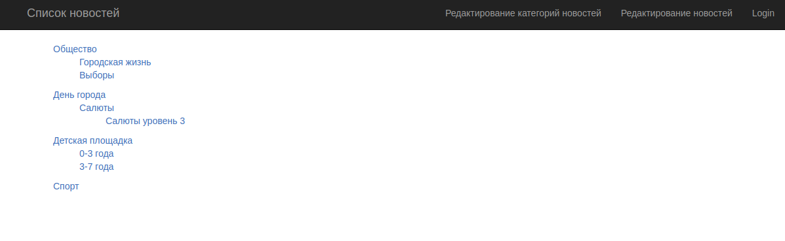
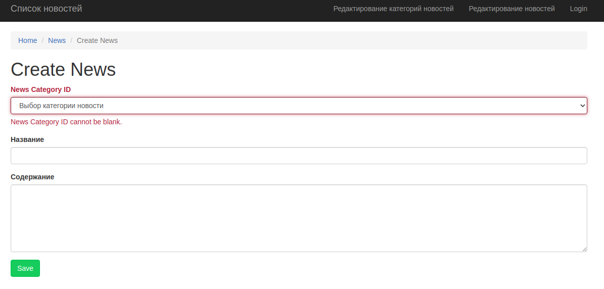
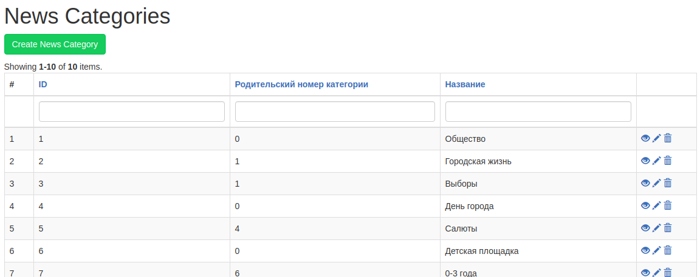
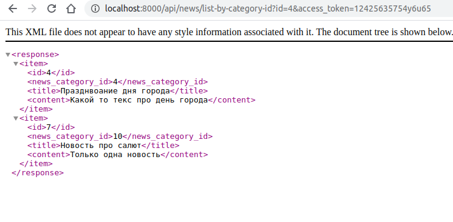
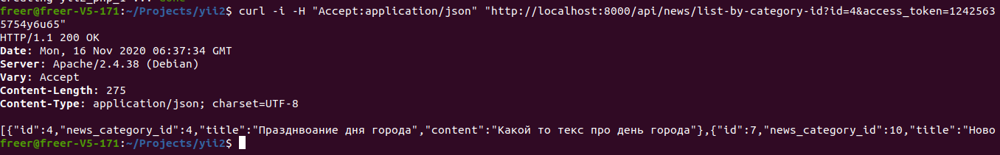
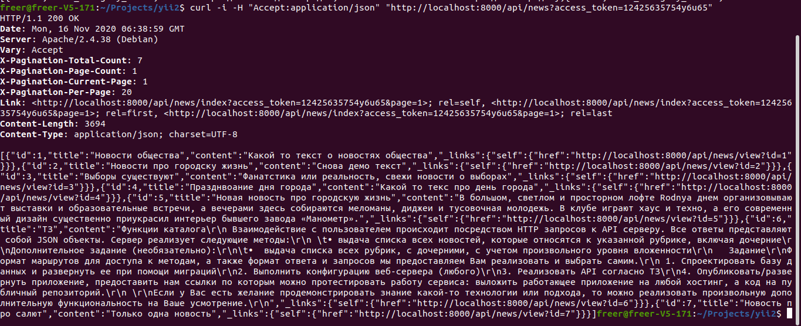
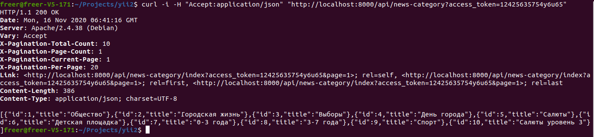

### Тестовое задание

## Задача
Требуется написать REST API стандартными средствами на YII2 с возможность работы в XML и JSON формате с ограничением числа запросов и проверкой токена
В API должны быть реализованы методы : 
Получение списка новостных категорий
Получение списка всех новостей
Получение списка новостей по категории
Получение отдельной новости

## Описание работы реализованного API
Список всех новостей выводится на главной 
Доступ к редактированию новостей и категорий новостей в пунктах меню  

REST API 
Получение списка новостных категорий /api/news-category 
Получение списка новостей /api/news 
Получение новостей по ветке категорий (включая подкатегории) /api/news/list-by-category-id?id=10 
Получение отдельной новости /api/news/view?id=1 
Методы update, delete и create отключены, все остальные стандартные запросы работают 
Проверка доступа к API через токен в get запросе 
Ограничение на число запросов RateLimitInterface 

Поднятие проекта через docker-compose 
Запуск миграций создаст таблицы и заполнит демо данными  

Примеры работы 

 
Пример запроса через браузер (без передачи json заголовков) и ответ в xml 
 
Получение новостей по категории 
 
Получение всех новостей 
 
Запрос на получение всех категорий (рубрик) 

